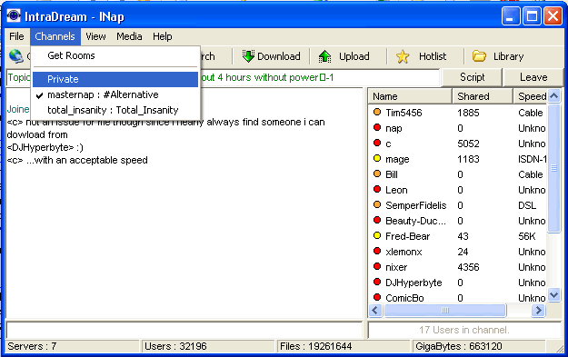



## INap Napster Client \(fully functional\)

### Description

A Napster Client based on opennap/slavanap protocol specs. it supports chat/pm/all forms of transfers/easy server connection/script support in chat/private message/hotlist/browse files/ and basic media player ability. a install and more screenshots available at http://www.intradream.com/inap/index.html . it dosnt have the file base some of the newer p2p apps have but it certinly isnt dead tons of people still use audioGnome and there still is a bunch of servers to connect to. i recomend using it for chating. Thats the best part of napster in my opinion.
 
### More Info
 

             |
---                |---
**Submitted On**   |2003-08-21 10:58:48
**By**             |[Timothy Marin](https://github.com/Planet-Source-Code/PSCIndex/blob/master/ByAuthor/timothy-marin.md)
**Level**          |Advanced
**User Rating**    |4.3 (26 globes from 6 users)
**Compatibility**  |VB 6\.0
**Category**       |[Complete Applications](https://github.com/Planet-Source-Code/PSCIndex/blob/master/ByCategory/complete-applications__1-27.md)
**World**          |[Visual Basic](https://github.com/Planet-Source-Code/PSCIndex/blob/master/ByWorld/visual-basic.md)
**Archive File**   |[INap\_Napst1633208212003\.zip](https://github.com/Planet-Source-Code/timothy-marin-inap-napster-client-fully-functional__1-47878/archive/master.zip)

